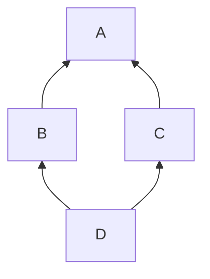

## 继承
**作用**：可以让子类拥有父类的所有成员，可以在拓展父类功能的同时复用已实现代码
**规则 **：
1. 用法：
    ```cpp
    class 子类名:继承方式 父类名{
        // 子类新增成员
    };
    ```
2. 被继承的类称为父类，继承的类称为子类
3. 子类包含了全部父类中除构造函数和析构函数外的所有成员
4. 子类可以直接使用父类中的公有成员`A::func();`，子类对象同理`b.A::func();`
5. 子类声明了和父类成员同名的新成员，父类成员函数和子类成员函数不会构成重载，子类的新成员会覆盖同名成员


## 多继承
**说明**：一个类可以同时拥有多个父类（**不建议使用**，会增加程序设计复杂度）
**规则**：
1. 用法：
    ```cpp
    class C:public A, public B{...};//C同时继承A和B
    ```
2. 子类同时拥有所有直接父类的成员
3. 子类在初始化列表中使用多个父类的构造函数，构造顺序按照继承的顺序
    ```cpp
    C::C():A(), B(){}
    ```
4. 子类拥有父类的同名成员变量时，父类成员虽然会覆盖掉，但是仍然占用内存
5. **二义性**：类`A`和类`B`包含同名成员`var_`，而多继承子类`C`没有`var_`，编译器不知道该使用哪一个`var_`，可以使用`A::var_`限定
6. 如果父类都有虚函数，那么子类会产生对应的多张虚表，虚指针在内存中顺序按照继承的顺序（见[虚函数表与虚指针](../7.内存模型/6.虚函数表与虚指针.md)）
### 菱形继承



> 菱形继承，类D会同时拥有多个类A中的数据，在产生命名冲突同时还会有数据冗余
### 虚继承
**作用**：解决多继承时的命名冲突和冗余数据问题，使得在子类中只保留一份间接父类的成员。

**规则**：
1. 用法：在继承方式前加上`virtual`关键字
    ```cpp
    //虚父类A
    class A{
    public:
        int x_;
    };
    //虚继承
    class B: virtual public A{
        …
    };
    class C: virtual public A{
        …
    };
    //只会保留一份间接父类A中的成员
    class D: public B, public C{
        …
    };
    ```
2. 类`B`和`C`需要虚继承，类`D`不需要
3. 虚继承只影响从指定了虚基类的子类中进一步派生出来的类`D`，它不会影响子类`B`、`C`。
4. 虚基类成员在所有子类成员后面
5. 利用虚基表指针和虚基表实现（类似于了虚函数表）


### 虚继承时的构造函数
最终子类不仅需要调用`B`, `C`的构造函数，还需要调用间接父类`A`的构造函数（`B`, `C`的构造函数对`A`的初始化是无效的，只有`D`有效，普通继承不能调用间接父类）
```cpp
D::D(int x1, int x2, int x3, int x4):
A(x1),B(x2),C(x3),D_x(x4)
{}
```

**调用顺序**：先调用虚父类的构造函数，再按出现顺序调用其他构造函数

