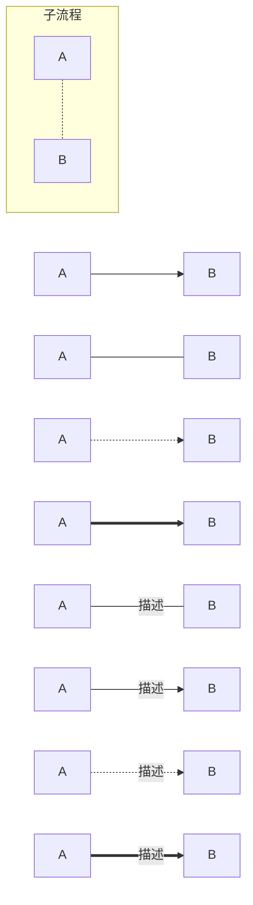

### 键盘键 kbd标签
<kbd>1</kbd>
### 待办事项
- [x] 1
- [ ] 2

### 页内跳转
[跳转到锚点](#jump)

<span id="jump">目标(锚点)</span>


### 代码折叠

<details>
<summary>折叠标题</summary>

```py
print("hello world")
```
</details>
### 流程图
1. 在代码块中选择mermaid语言
2. 流程图方向控制:
   1. TB 从上到下
   2. BT 从下到上
   3. RL 从右到左
   4. LR 从左到右
3. 节点格式:id[内容]
   1. [] 矩形
   2. () 圆角矩形
   3. \>] 不对称矩形
   4. {} 菱形
   5. (()) 圆形
4. 节点连接
   1. --> 带箭头
   2. -- 不带箭头
   3. -.- 虚线
   4. -.-> 带箭头虚线
   5. == 加粗
   6. --描述-- 加入描述文字
5. 子流程图:
```c
   subgraph title
        graph
   end
```   
